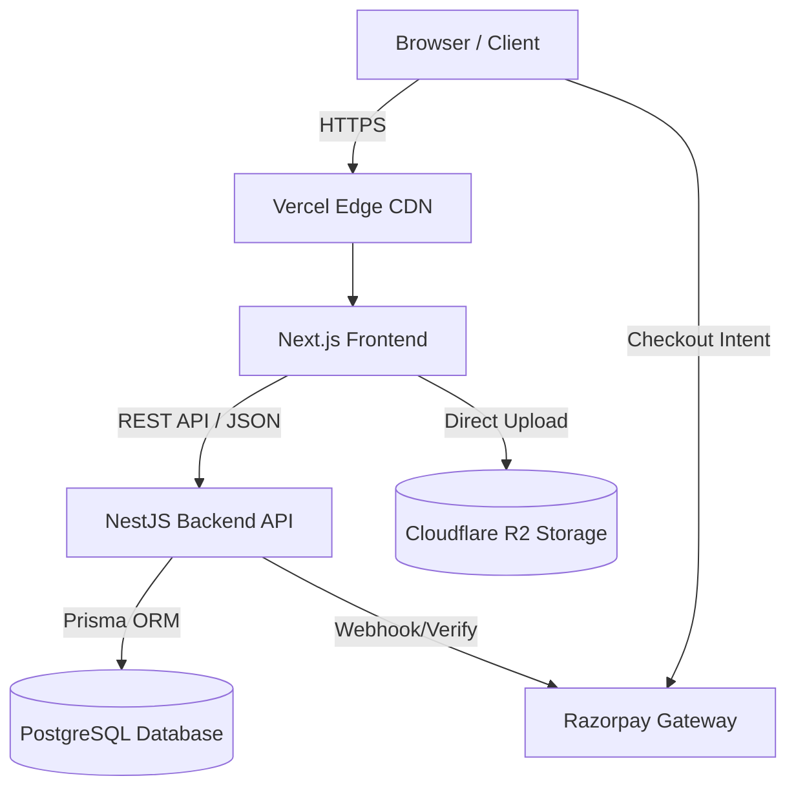

# 03 Software Architecture

This document defines the physical and logical architecture of the Only3D platform, justifying all technology choices against the requirements of a scalable, enterprise-grade manufacturing system.

## 1. High-Level Architecture Diagram

_(Logical flow of the system)_

## 2. Monorepo Strategy

The project is structured as a strict Monorepo using **Turborepo** or **Nx**. This prevents "schema drift" between the frontend and backend, ensuring that an API payload generated by NestJS is strictly typed when consumed by Next.js.

### 2.1 Workspace Structure

- `apps/web`: The Next.js application (Public site, Customer Portal, Admin Dashboard).
- `apps/api`: The NestJS REST API.
- `packages/database`: Contains the Prisma schema, migration history, and exports the generated Prisma Client. Both `web` and `api` depend on this package.
- `packages/ui`: The centralized React component library (Tailwind, shadcn/ui). Ensures UI consistency across Admin and Public interfaces.
- `packages/types`: Shared Zod schemas (for runtime validation) and TypeScript interfaces (for API contracts).
- `packages/utils`: Shared mathematical functions (e.g., bounding box volume calculators) to ensure the frontend quote estimate perfectly matches the backend source-of-truth validation.

## 3. Frontend Architecture (Next.js)

**Why Next.js?** Only3D requires extreme SEO performance for its public marketing pages (Materials, Products, Blog), while simultaneously requiring highly dynamic, authenticated Single Page Application (SPA) behavior for the Admin Dashboard and Quote Engine. Next.js App Router elegantly handles both paradigms.

- **Public Pages:** Utilize React Server Components (RSC) and Static Site Generation (SSG). Data (like the Materials list) is fetched at build time or revalidated periodically (ISR).
- **Admin/Customer Dashboards:** Utilize Client Components (`"use client"`) heavily, leveraging React Query (TanStack Query) or SWR for complex client-side state management, caching, and optimistic UI updates.
- **Styling:** Tailwind CSS enforces the design tokens defined in `09_DESIGN_SYSTEM.md`.

## 4. Backend Architecture (NestJS)

**Why NestJS?** The manufacturing logic (Quote Engine math, Order State Machines, RBAC validation) is too complex and critical for simple Next.js API routes. NestJS enforces a highly structured, testable, Object-Oriented paradigm.

- **Controllers:** Handle HTTP routing and payload validation using Zod/Class-validator (`packages/types`).
- **Services:** Contain the pure business logic (e.g., `QuoteCalculatorService`).
- **Modules:** Code is organized by domain (`OrdersModule`, `AuthModule`, `CatalogModule`), ensuring clear separation of concerns.
- **Transactions:** Complex operations (e.g., converting a Quote to an Order while applying a Coupon) rely on Prisma database transactions to guarantee ACID compliance.

## 5. Database Architecture (PostgreSQL & Prisma)

**Why PostgreSQL?** The relationships in Only3D are deeply relational. A NoSQL document store would fail to cleanly map the intricate relationships between Printers, Materials, Colors, and Pricing Rules.
**Why Prisma?** It provides a type-safe database client that drastically reduces runtime errors and accelerates development across the monorepo. (See `04_DATABASE.md` for the exact schema).

## 6. File Storage (Cloudflare R2)

**Why R2?** 3D manufacturing involves storing gigabytes of STL and 3MF files. Cloudflare R2 provides an AWS S3-compatible API but eliminates egress bandwidth fees, which is critical for profitability as the asset library grows.

### 6.1 Upload Flow

To prevent the NestJS server from bottlenecking on large file uploads:

1.  Frontend requests a pre-signed upload URL from the NestJS API.
2.  NestJS generates the signature using AWS SDK for R2.
3.  Frontend uploads the `.stl` file directly to Cloudflare R2.
4.  Frontend notifies NestJS of completion, and the database record is created.

## 7. Payments (Razorpay)

**Why Razorpay?** It is the dominant, most reliable payment gateway in India, natively supporting UPI, domestic credit cards, and net banking.
Integration relies heavily on webhook verification (`13_SECURITY_MODEL.md`) to transition orders from `PENDING` to `PROCESSING` only when cryptographic proof of payment is received from Razorpay servers.
