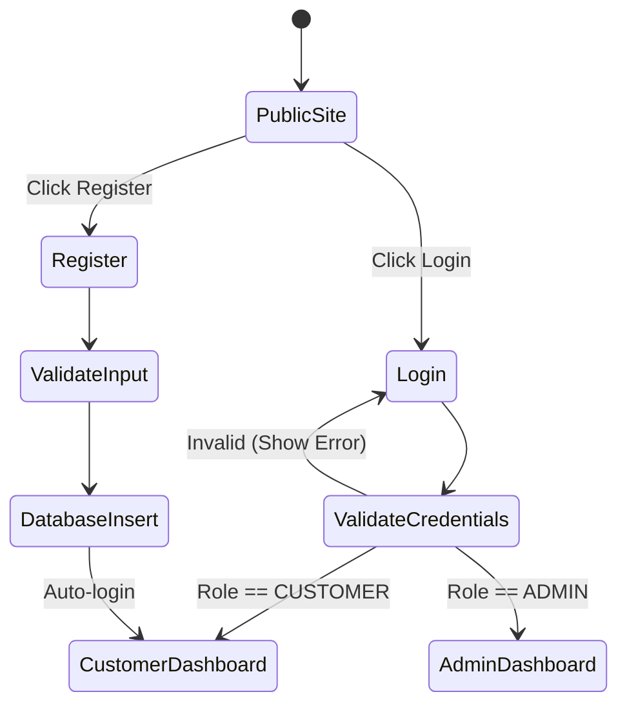
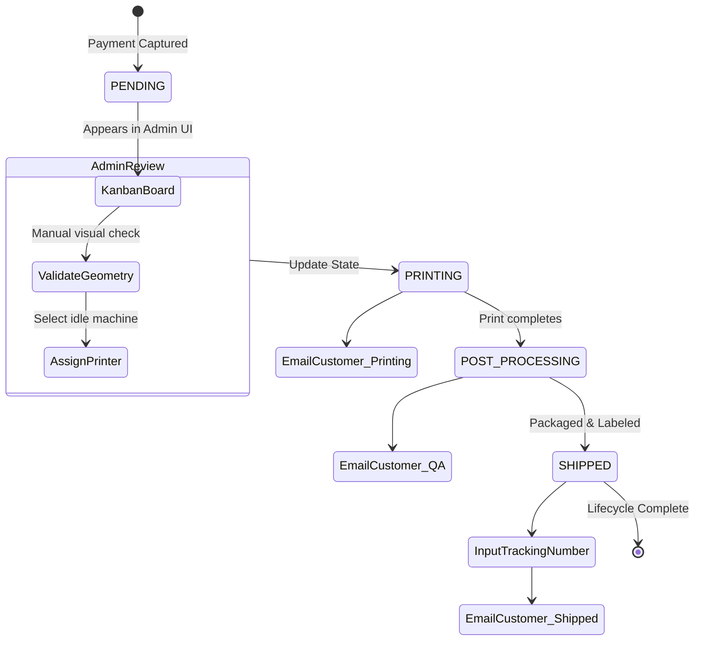

# 17 User Flows & Journeys

_References: `02_PRD.md`, `08_QUOTE_ENGINE.md`_

## 1. Authentication Flows



## 2. The Instant Quote & Checkout Journey (Customer)

```mermaid
stateDiagram-v2
    [*] --> Homepage
    Homepage --> UploadZone : Drag & Drop STL

    state UploadPhase {
        UploadZone --> R2Storage : Direct PUT (Presigned)
        R2Storage --> GeometryParser : Trigger Webhook/Queue
        GeometryParser --> QuoteEngineUI : Return Bounding Box & Volume
    }

    UploadPhase --> Configurator

    state Configurator {
        Configurator --> SelectMaterial
        SelectMaterial --> SelectColor
        SelectColor --> SelectPrinter
        SelectPrinter --> CalculatePrice : Fetch PricingRules
        CalculatePrice --> DisplayPrice : < 100ms
    }

    Configurator --> Checkout : Click 'Proceed'

    state CheckoutPhase {
        Checkout --> ValidateAddress
        ValidateAddress --> ApplyCoupon
        ApplyCoupon --> RazorpayIntent
        RazorpayIntent --> PaymentGateway : Redirect/Modal
        PaymentGateway --> OrderSuccess : Webhook Verified
        PaymentGateway --> OrderFailed : Signature Mismatch
    }

    CheckoutPhase --> CustomerDashboard : View Order Status
```

## 3. The Order Fulfillment Lifecycle (Admin)



## 4. Edge Case Journeys

- **Unprintable Geometry:** If the geometry parser returns dimensions $> MaxPrinterVolume$, the flow diverts. The user cannot proceed to checkout. They are shown a "Request Manual Review" button which creates a `DRAFT` quote and alerts an Admin.
- **Payment Failure:** If Razorpay returns a failure, the Quote is saved to the Customer's dashboard as `SAVED` so they do not have to reconfigure the part. They can click "Retry Payment" at any time.
