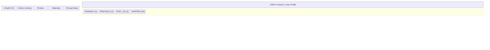
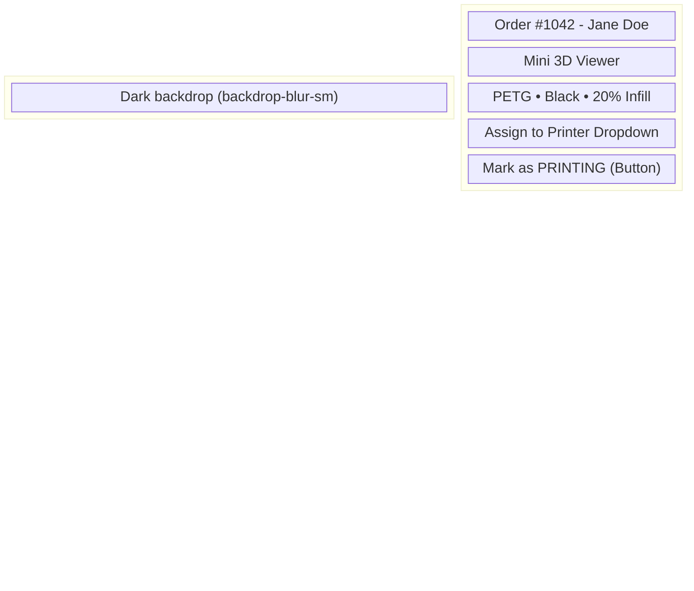
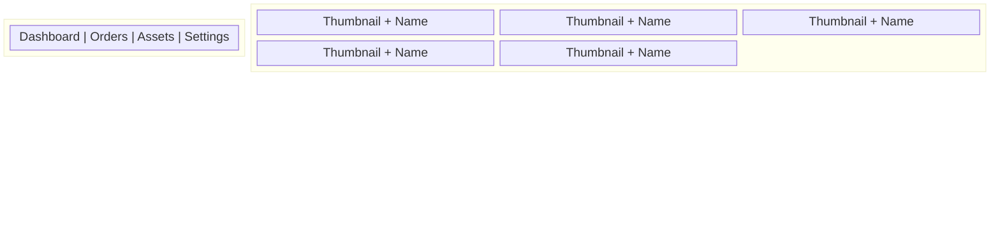

# 18 Wireframe Architectures

This document mathematically maps the visual grid and spatial relationships of the Only3D platform. _UI Inspiration: Linear (Admin), Vercel (Customer), Apple (Public)._

## 1. Grid Definitions

- **Desktop:** 12-column grid. Max container width: `1440px`. Gutters: `24px` (`gap-6`).
- **Tablet:** 8-column grid. Gutters: `16px` (`gap-4`).
- **Mobile:** 4-column grid. Gutters: `16px` (`gap-4`).

## 2. Public Website: Instant Quote Layout

_Target: Minimal distraction, focus on the 3D viewer and price._

_Rules:_ The Configurator must be `sticky top-4` so it remains visible if the 3D Viewer height exceeds the viewport.

## 3. Admin OS: Fulfillment Dashboard

_Target: Extreme data density. Zero wasted space. Keyboard-first._

_Rules:_ Sidebar is fixed. Topbar is fixed. Kanban columns scroll vertically independently (`overflow-y-auto`).

## 4. Admin OS: Order Action Drawer

_Target: Slides in from the right edge. Overlays the Kanban board._

## 5. Customer Portal: Asset Library

_Target: Clean, visual grid of intellectual property._

_Rules:_ Cards use CSS aspect ratio `aspect-square` for perfect grid alignment. Hovering a card reveals the "Re-quote" overlay.
