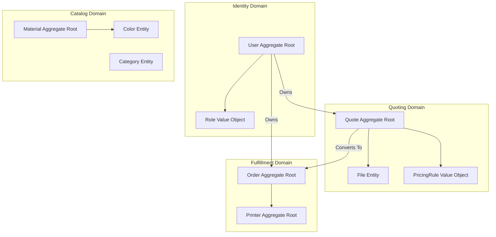

# 21 Domain Model Architecture

## 1. Purpose

Defines the absolute boundaries and ubiquitous language of the Only3D platform using Domain-Driven Design (DDD) principles. Ensures all engineers share the same mental model of the physical and software domains.

## 2. Scope

Covers the core business domains: Catalog, Quoting, Fulfillment, and Identity. Excludes external infrastructure concerns (like R2 implementation details).

## 3. Responsibilities

- Map the physical reality (Printers, Filament) to software aggregates.
- Define the aggregate roots for database transactions.

## 4. Dependencies

- Must align with `04_DATABASE.md` (Physical Schema).
- Must inform `05_API.md` (Domain Boundaries).

## 5. Domain Diagram

## 6. Data Flow & Aggregate Roots

- **Order Aggregate:** The central nervous system. Modifying an `Order`'s status requires a lock on the Order entity to prevent race conditions during concurrent admin edits.
- **Material Aggregate:** Changing a `Material` cost propagates downward to all _future_ quotes, but the aggregate boundary prevents it from mutating historical Orders.

## 7. Failure Scenarios

- **Domain Constraint Violation:** If a `Printer` is moved to `MAINTENANCE` state, the Fulfillment Domain must reject any attempt to assign an `Order` to it, throwing a `DomainException`.

## 8. Future Scalability

- The tight domain boundaries allow us to eventually split the NestJS monolith into microservices (e.g., `QuotingService`, `FulfillmentService`) communicating via gRPC or Kafka.

## 9. Risks

- **Anemic Domain Model:** If business logic leaks out of the Domain into NestJS Controllers or Next.js UI, it will lead to massive technical debt. All math must live in the Domain layer (`packages/utils`).

## 10. Open Questions

- Should a single `Order` be able to contain multiple `Quotes` (a shopping cart model), or should we enforce a strict 1-to-1 Quote-to-Order mapping for V1 to simplify the factory floor? _(Decision: V1 will enforce 1-to-1 for operational simplicity)._

## 11. Cross References

- `04_DATABASE.md`
- `22_BUSINESS_RULES.md`
