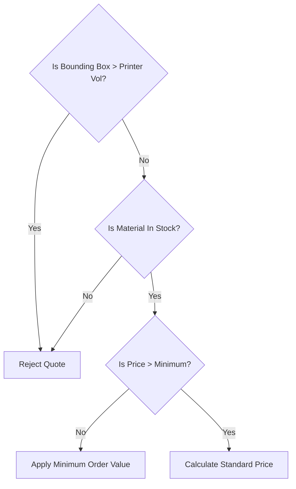

# 22 Business Rules Registry

## 1. Purpose

To act as the definitive dictionary for all immutable business logic governing the Only3D platform. These rules dictate what the software is _allowed_ to do.

## 2. Scope

Covers pricing logic restrictions, inventory logic, and operational constraints. Excludes UI/UX rules.

## 3. Responsibilities

- Provide a single source of truth for QA and backend engineers.
- Prevent contradictory logic implementation.

## 4. Dependencies

- Directly informs `08_QUOTE_ENGINE.md`.
- Directly informs `21_DOMAIN_MODEL.md`.

## 5. Logic Diagram

## 6. Core Rule Definitions

- **BR-001 (Minimum Order Value):** An order's subtotal cannot fall below `Admin.MinimumOrderValue` (e.g., ₹500). If the calculated math yields ₹200, the system overrides it to ₹500.
- **BR-002 (Immutable History):** Once a `Quote` is converted to an `Order`, its pricing and specs are frozen. Changes to `Material` costs or `PricingRules` do not cascade historically.
- **BR-003 (Printer Assignment Validation):** An Admin cannot assign an `Order` requiring "Nylon" to a `Printer` that only supports "PLA".
- **BR-004 (Quote Expiration):** A `SAVED` quote expires after exactly 14 days to prevent customers from exploiting old material prices.

## 7. Failure Scenarios

- If an Admin attempts to violate BR-003, the API must return `409 Conflict: Printer Incompatible with Material`.

## 8. Future Scalability

- Rules are currently evaluated synchronously. Future complex rules (e.g., thermal stress analysis) will require async evaluation queues.

## 9. Risks

- **Rule Drift:** If a business rule is implemented on the Next.js frontend but forgotten on the NestJS backend, users can bypass it. **Mitigation:** All business rules must be enforced server-side.

## 10. Open Questions

- How should we handle partial refunds if a multi-part order fails during printing?

## 11. Cross References

- `08_QUOTE_ENGINE.md`
- `14_TESTING_STRATEGY.md`
