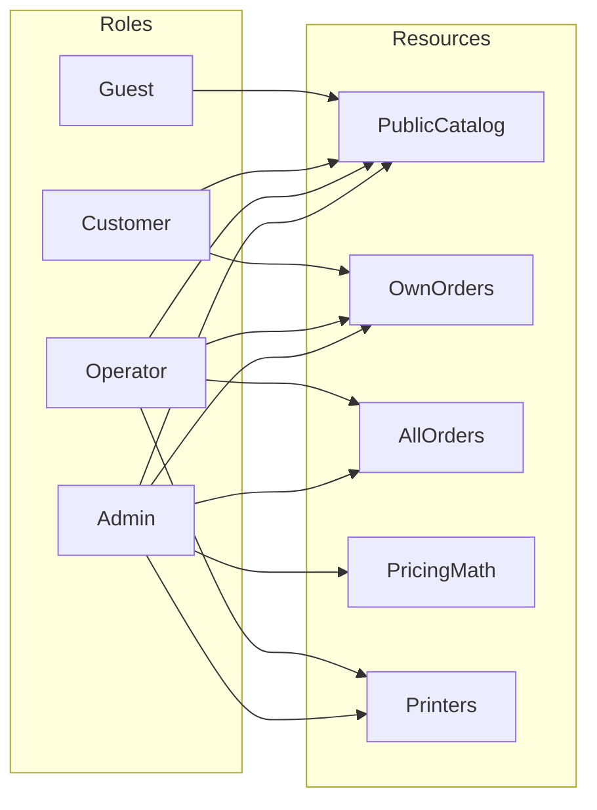

# 23 Permissions & Roles (RBAC)

## 1. Purpose

Defines the strict access control matrix for the entire platform, ensuring data isolation and operational security.

## 2. Scope

Covers endpoint authorization, UI visibility toggles, and R2 asset access.

## 3. Responsibilities

- Define the exact capabilities of `GUEST`, `CUSTOMER`, `OPERATOR`, and `ADMIN`.

## 4. Dependencies

- Relies on `13_SECURITY_MODEL.md` (JWT implementation).

## 5. RBAC Matrix Diagram

## 6. Role Definitions & Data Flow

- **GUEST (Unauthenticated):** Can view the public site, read material datasheets, and generate draft quotes (if `ALLOW_GUEST_QUOTES` toggle is true).
- **CUSTOMER (Authenticated):** Can read/write `File`, `Quote`, and `Order` entities where `userId` matches their JWT. Denied access to any resource where `userId` mismatches.
- **OPERATOR (Authenticated):** Can read all `Order` entities, assign `Order`s to `Printer`s, and transition states (`PENDING` -> `PRINTING`). _Cannot_ alter financial math or global settings.
- **ADMIN (Authenticated):** God-mode. Full CRUD over `PricingRule`, `SiteSetting`, `Material`, and user data.

## 7. Failure Scenarios

- If a `CUSTOMER` attempts to `GET /api/admin/orders`, NestJS throws a `403 Forbidden`.
- If a `CUSTOMER` attempts to `GET /api/customer/orders/:id` for an order belonging to another user, NestJS throws `404 Not Found` (to prevent ID enumeration attacks) or `403`.

## 8. Future Scalability

- The `Role` enum allows easy future expansion (e.g., adding a `SALES` role with read-only access to CRM data).

## 9. Risks

- Improperly scoping R2 signed URL generation could leak intellectual property. The backend must strictly verify the `userId` attached to the `File` before generating the presigned GET URL.

## 10. Open Questions

- Should Operators be allowed to apply manual discounts to orders in the queue to resolve customer disputes? _(Decision: No, only Admins for V1)._

## 11. Cross References

- `05_API.md`
- `13_SECURITY_MODEL.md`
