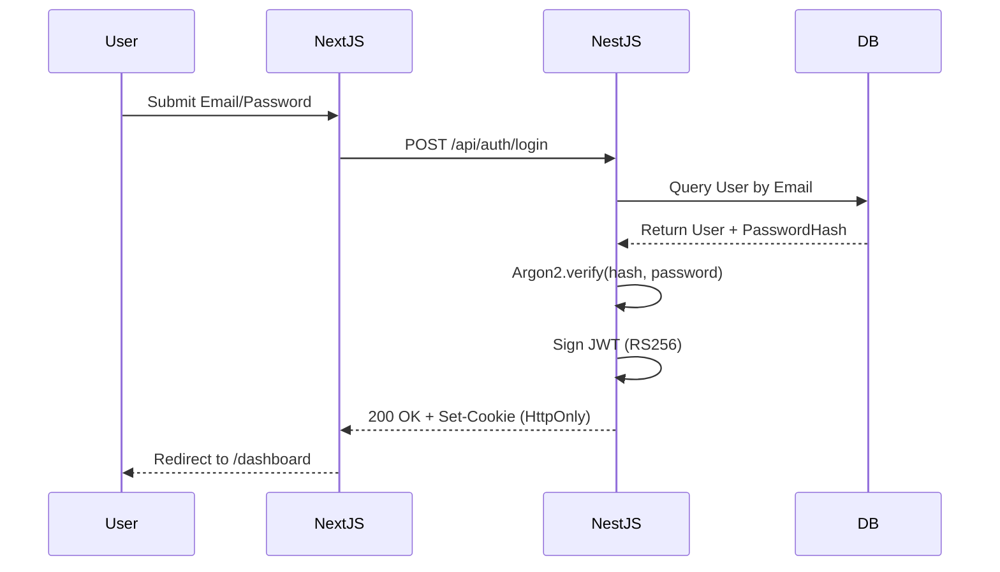

# 24 Authentication & Authorization Architecture

## 1. Purpose

Defines the exact cryptographic mechanisms and data flows for verifying user identity and authorizing actions, ensuring a zero-trust model between the Next.js frontend and NestJS backend.

## 2. Scope

Covers JWT lifecycle, password hashing, session revocation, and cross-domain token passing.

## 3. Responsibilities

- **NestJS (`AuthModule`):** The sole authority on identity. Issues, signs, and validates JWTs. Hashes passwords.
- **Next.js (Middleware):** Reads the JWT cookie purely to route users (e.g., redirecting unauthenticated users away from `/dashboard`). It does _not_ validate the cryptographic signature.

## 4. Dependencies

- `04_DATABASE.md` (User entity)
- `23_PERMISSIONS_ROLES.md` (RBAC)

## 5. Data Flow (Login)

## 6. Token Specification

- **Algorithm:** `RS256` (Asymmetric). NestJS holds the private key to sign.
- **Payload:** `{ sub: "uuid", role: "ADMIN", iat: 1718290000, exp: 1718376400 }`
- **Transport:** The token is transported _exclusively_ via an `HttpOnly, Secure, SameSite=Lax` cookie. It is never stored in `localStorage` to prevent XSS exfiltration.

## 7. Failure Scenarios

- **Token Expiry:** If a user submits a request with an expired token, NestJS returns `401 Unauthorized`. Next.js intercepts this via Axios interceptor and redirects to `/login`.

## 8. Future Scalability

- Using asymmetric `RS256` allows us to introduce a separate microservice later (e.g., a dedicated `FileProcessingService`) that can cryptographically verify the JWT using only the public key, without needing to contact the `AuthModule`.

## 9. Risks

- **Cookie CSRF:** Because we use cookies, Cross-Site Request Forgery is a risk. **Mitigation:** SameSite cookie attributes and strict CORS policies on the NestJS backend.

## 10. Open Questions

- Do we need OAuth2 (Google/GitHub login) for V1? _(Decision: Deferred to V2. V1 uses Email/Password only)._

## 11. Cross References

- `13_SECURITY_MODEL.md`
