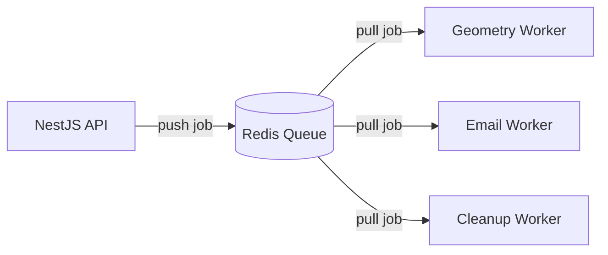

# 26 Background Jobs & Queue System

## 1. Purpose

To ensure the main NestJS HTTP event loop remains unblocked and responsive by offloading heavy computational tasks or unreliable network requests.

## 2. Scope

Covers Redis-backed message queues using BullMQ within NestJS.

## 3. Responsibilities

- **Producer:** NestJS Controllers/Services that push jobs to the queue.
- **Consumer (Worker):** Dedicated processes that pop jobs from the queue and execute them.

## 4. Dependencies

- Requires a Redis instance (deployed via Railway).
- `25_EVENT_ARCHITECTURE.md`

## 5. Queue Diagram

## 6. Core Queues

1.  **`geometry-parsing` Queue:** Very CPU-intensive. Parses STL files to calculate volume.
2.  **`notifications` Queue:** I/O bound. Sends emails via Resend/Sendgrid. Retries automatically on 3rd-party API failure.
3.  **`cron-tasks` Queue:** Scheduled jobs.
    - _Task:_ Cleanup abandoned R2 files. (Find `File` records older than 24h with no associated `Quote`, delete from R2, soft delete in DB).
    - _Task:_ Expire old Quotes. (Transition `QuoteStatus` from `SAVED` to `EXPIRED` if > 14 days old).

## 7. Failure Scenarios

- **Worker Crash:** If a worker crashes mid-job, BullMQ's lock expires, and the job is automatically returned to the queue for retry.
- **Poison Pill:** If a job fails 3 times, it is moved to a Dead Letter Queue (DLQ) for manual Admin inspection.

## 8. Future Scalability

- Workers can be detached from the main API repository and deployed as independent serverless functions or containerized microservices scaling horizontally based on Redis queue depth.

## 9. Risks

- **Redis OOM (Out of Memory):** If the API produces jobs faster than workers can consume, Redis memory will fill up. **Mitigation:** Implement strict job TTLs (Time to Live) and monitor queue depth via `16_OPERATIONS_MONITORING.md`.

## 10. Open Questions

- None.

## 11. Cross References

- `15_DEPLOYMENT_PIPELINE.md`
