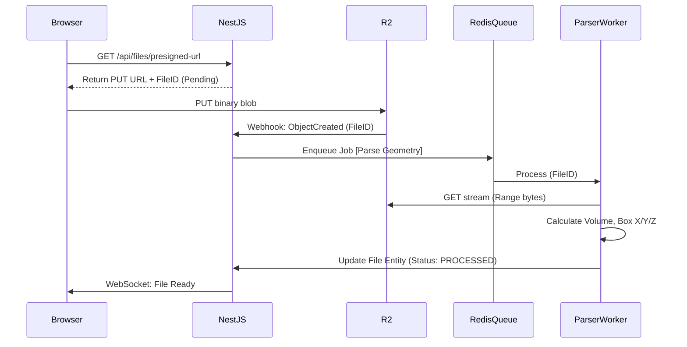

# 27 File Processing Pipeline

## 1. Purpose

Details the exact workflow for handling customer-uploaded 3D geometry files (STL, 3MF) to extract the mathematical properties (volume, bounding box) required for the Quote Engine.

## 2. Scope

Covers R2 direct uploads, webhooks, binary parsing, and database synchronization.

## 3. Responsibilities

- **Next.js Client:** Directly uploads the binary blob to R2 via Presigned PUT URL.
- **Cloudflare R2:** Stores the object and triggers an Event Notification (Webhook).
- **NestJS API:** Receives the R2 webhook, dispatches a BullMQ job to parse the geometry, and updates the `File` entity with bounding box math.

## 4. Dependencies

- `26_BACKGROUND_JOBS.md` (Queue implementation)
- `08_QUOTE_ENGINE.md` (Consumes the math output)

## 5. Data Flow Diagram

## 6. Failure Scenarios

- **Malformed STL/Corrupted File:** The ParserWorker will throw a `ParsingError`. The `File` entity status becomes `ERROR`. Next.js displays "Invalid Geometry" to the user.
- **R2 Webhook Failure:** If Cloudflare fails to fire the webhook, the file remains in `PENDING` state indefinitely. _Mitigation:_ A Cron job runs hourly to identify `PENDING` files > 1hr old and manually triggers a parse job.

## 7. Future Scalability

- **Mesh Repair:** In V2, the pipeline will expand to pass broken STLs through a mesh-repairing microservice (e.g., using Netfabb APIs or custom C++ bindings).
- **Thumbnail Generation:** V2 will render a 2D PNG thumbnail from the 3D file for the Customer Dashboard.

## 8. Risks

- **Memory Exhaustion:** Parsing a 500MB STL directly into Node.js RAM will crash the worker. The ParserWorker _must_ process files using `fs.createReadStream` and a chunked binary parser (e.g., `NodeSTL`).

## 9. Open Questions

- Should we reject files larger than a certain size? _(Decision: Yes, V1 cap is 150MB, enforced at the R2 Presigned URL generation step)._

## 10. Cross References

- `13_SECURITY_MODEL.md`
