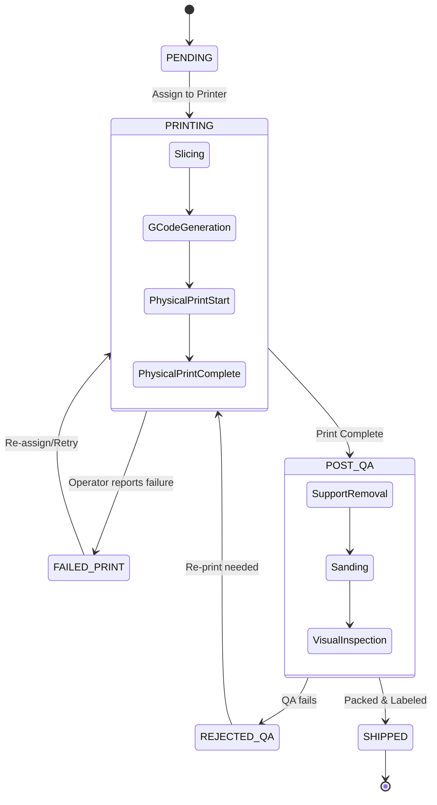

# 28 Manufacturing Workflow

## 1. Purpose

Maps the physical factory floor operations to software states. The Only3D platform is a digital twin of the physical 3D printing farm.

## 2. Scope

Covers the journey of an Order from Admin approval to shipping label generation.

## 3. Responsibilities

- **Admin/Operator:** Physically moves filament, starts prints, performs QA, and updates the software UI to match physical reality.
- **Software:** Enforces constraints (e.g., preventing two orders from being assigned to the same printer simultaneously).

## 4. Dependencies

- `17_USER_FLOWS.md`
- `22_BUSINESS_RULES.md`

## 5. State Machine Diagram

## 6. Physical/Digital Sync Constraints

- **Printer Lock:** When an Order enters `PRINTING`, its assigned `Printer` entity is locked (`Status: BUSY`). The Admin UI removes this printer from all "Assign Printer" dropdowns until the order reaches `POST_QA` or `FAILED_PRINT`.
- **Operator Prompts:** When an order enters `FAILED_PRINT`, the UI demands a "Failure Reason" (e.g., Adhesion Failure, Spaghetti, Power Loss) to build analytical data on print reliability.

## 7. Failure Scenarios

- **Operator Error:** An operator marks an order as `SHIPPED` before it physically leaves the building. The system must allow reversing `SHIPPED` back to `POST_QA` (strictly for ADMIN roles only).

## 8. Future Scalability

- **Auto-Slicing integration:** V2 will automatically generate G-Code using an API (e.g., Kiri:Moto or PrusaSlicer CLI) and send it directly to the physical printers via OctoPrint/Klipper APIs, removing the need for manual Operator slicing.

## 9. Risks

- Software state desyncs from physical reality if operators forget to update the Kanban board. _Mitigation:_ In future versions, OctoPrint webhooks will automatically advance the software state to `POST_QA` when the physical printer finishes.

## 10. Open Questions

- None.

## 11. Cross References

- `31_PRINTER_MANAGEMENT.md`
