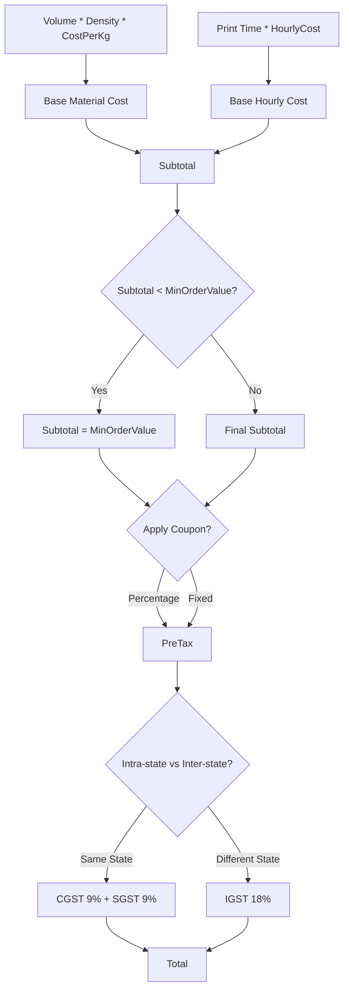

# 29 Pricing Engine Rules (Deep Dive)

## 1. Purpose

Expands upon `08_QUOTE_ENGINE.md` to define the granular business logic of taxation, minimums, multi-part quotes, and discount application.

## 2. Scope

Covers cart aggregation, IGST/CGST/SGST (India tax laws), and Coupon logic.

## 3. Responsibilities

- **NestJS `QuoteService`:** Single source of truth for all mathematical currency operations.

## 4. Dependencies

- `08_QUOTE_ENGINE.md` (Base Math)
- `22_BUSINESS_RULES.md`

## 5. Calculation Data Flow

## 6. Taxation Rules (India 3D Printing GST)

- Custom 3D printing falls under specific GST/HSN codes (typically 18%).
- **Source:** Only3D is based in India.
- **Destination:** The Customer's shipping state.
- _Rule:_ If Customer State == Only3D State, apply CGST (9%) + SGST (9%). Else, apply IGST (18%).

## 7. Coupon/Discount Logic

- Coupons are processed _before_ tax, but _after_ the Minimum Order Value check.
- `Coupon` Entity contains `code`, `discountType` (`PERCENTAGE` or `FIXED`), `value`, and `maxDiscountValue` (to prevent a 50% off coupon from giving away ₹1,00,000 for free).

## 8. Failure Scenarios

- Floating Point precision errors. _Mitigation:_ All currency is stored in the database as integers (smallest currency unit, e.g., Paise). ₹100.50 is stored as `10050`. The frontend converts it back to decimal for display.

## 9. Future Scalability

- Support for multiple currencies (USD, EUR) via a `Currency` conversion table fetching daily exchange rates.

## 10. Risks

- Failing to apply the Minimum Order Value _before_ the discount could result in an order that costs ₹50, which loses the company money on packaging.

## 11. Cross References

- `08_QUOTE_ENGINE.md`
