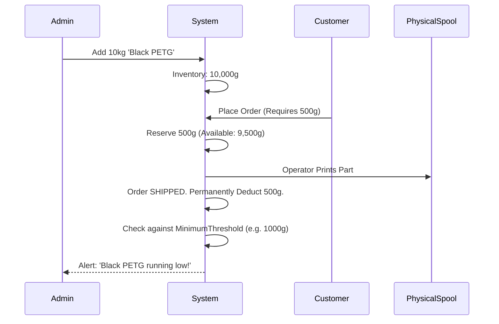

# 30 Inventory & Material Management

## 1. Purpose

Defines how the software tracks the physical consumption of plastic filament spools to prevent selling out-of-stock materials and to trigger re-ordering.

## 2. Scope

Covers `Material`, `MaterialColor`, and `InventoryTransaction` entities.

## 3. Responsibilities

- **Quote Engine:** Deducts theoretical weight from inventory when an Order is placed.
- **Admin OS:** Allows manual inventory reconciliation.

## 4. Dependencies

- `04_DATABASE.md`
- `08_QUOTE_ENGINE.md`

## 5. Inventory Lifecycle Diagram

## 6. Weight vs Spool Tracking

- We do _not_ track individual physical 1kg spools in V1.
- We track total bulk weight per `MaterialColor` (e.g., We have 15,200 grams of Red PLA).
- _Why?_ Tracking individual spools introduces massive operational overhead for Operators (scanning barcodes every time they swap a spool).

## 7. Failure Scenarios

- **Failed Prints:** If a print fails, the plastic is wasted. The Operator must manually log a "Waste Transaction" in the Admin OS to deduct the wasted grams from the total bulk weight, keeping the digital inventory synced with physical reality.

## 8. Future Scalability

- Integration with Supplier APIs to automatically generate Purchase Orders when inventory drops below the `MinimumThreshold`.

## 9. Risks

- Theoretical weight (calculated by the Quote Engine volume \* density) rarely matches actual physical extruded weight perfectly due to infill algorithms.
- _Mitigation:_ Admins must perform a physical inventory audit once a month and input a manual `InventoryReconciliation` transaction to correct the software balance.

## 10. Open Questions

- None.

## 11. Cross References

- `28_MANUFACTURING_WORKFLOW.md`
