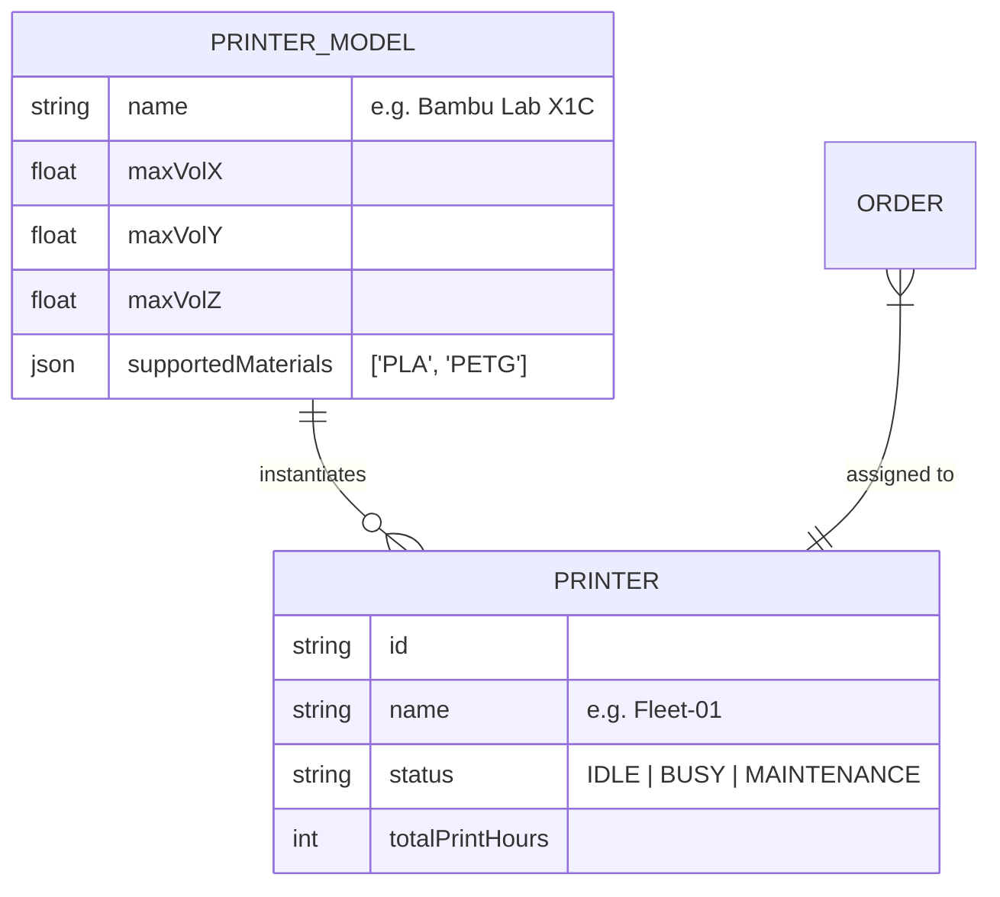

# 31 Printer Management Architecture

## 1. Purpose

Defines the software's understanding of the physical printing fleet, its constraints, and state tracking.

## 2. Scope

Covers `Printer` entities, Printer Models, constraints (max dimensions, supported materials), and physical state tracking.

## 3. Responsibilities

- **Fulfillment Domain:** Prevents assigning incompatible geometries or materials to specific printers.
- **Admin UI:** Visualizes fleet health and capacity.

## 4. Dependencies

- `08_QUOTE_ENGINE.md`
- `22_BUSINESS_RULES.md`

## 5. Entity Relationship & Data Flow

## 6. Constraints Logic

- Before an Order can be assigned, the system evaluates:
  1.  Is the Printer `status == IDLE`?
  2.  Does `Order.Material` exist in `PrinterModel.supportedMaterials`?
  3.  Does `Order.BoundingBox` fit within `PrinterModel.maxVol`?

## 7. Failure Scenarios

- If an Operator physically removes a broken printer from service, they set `status = MAINTENANCE`. Any Order currently assigned to it (but not yet finished) is automatically kicked back to the `PENDING` queue.

## 8. Future Scalability

- Integration with MQTT/OctoPrint to automatically sync the software `status` with the physical machine's telemetry (no-touch state updates).

## 9. Risks

- Software assuming a printer is `IDLE` when it's physically jammed. This is why manual Operator overrides in the Admin Dashboard are required for V1.

## 10. Open Questions

- Should the system auto-assign orders to idle printers based on load-balancing? _(Decision: No, V1 is manual assignment by Operators)._

## 11. Cross References

- `28_MANUFACTURING_WORKFLOW.md`
