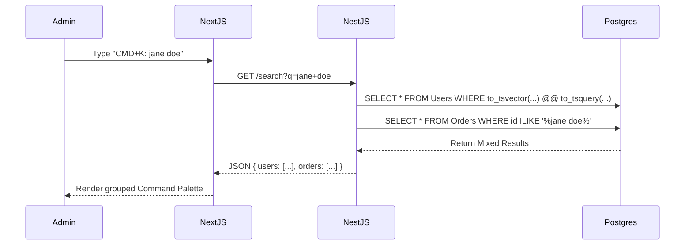

# 32 Search Architecture

## 1. Purpose

Defines the global search capabilities across the Admin OS (Command Palette) and Customer Portal, allowing instant retrieval of Orders, Customers, and Assets.

## 2. Scope

Covers PostgreSQL Full-Text Search (FTS) and `cmdk` integration. Excludes external search engines like ElasticSearch or Algolia for V1.

## 3. Responsibilities

- **NestJS:** Provides a unified `/api/admin/search?q=xyz` endpoint.
- **PostgreSQL:** Handles indexing and text matching.

## 4. Dependencies

- `20_ADMIN_INFORMATION_ARCHITECTURE.md`

## 5. Search Data Flow

## 6. Search Modifiers & Indexes

- **PostgreSQL Indexes:** To ensure sub-50ms search, B-Tree indexes are applied to `Order.id` and `User.email`. GIN (Generalized Inverted Index) is applied to `User.name` for full-text search.
- **Order Search:** Users often search by the last 4 digits of an Order ID. The query must support partial string matching (`ILIKE`).

## 7. Failure Scenarios

- If the search query is too vague (e.g., "a"), the database could scan millions of rows. _Mitigation:_ Require a minimum of 3 characters before firing the API request, and limit SQL results to `LIMIT 10` per category.

## 8. Future Scalability

- If the database exceeds 1 million rows and `ILIKE` becomes a bottleneck, we will migrate the search index to Typesense or Algolia.

## 9. Risks

- **Data Leakage:** The `/search` endpoint must strictly enforce RBAC. A `CUSTOMER` searching must only return their own Orders, whereas an `ADMIN` searching the exact same endpoint returns global results.

## 10. Open Questions

- None.

## 11. Cross References

- `23_PERMISSIONS_ROLES.md`
