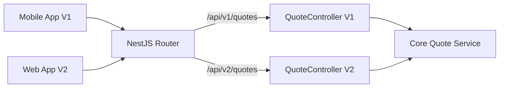

# 33 API Versioning Strategy

## 1. Purpose

Establishes the rules for modifying the NestJS API over the next 5-10 years without breaking existing clients (Next.js frontend, future Mobile Apps, or B2B integrations).

## 2. Scope

Covers URI versioning, deprecation policies, and backward compatibility.

## 3. Responsibilities

- **NestJS:** Implements URL prefixing (`/api/v1/...`).

## 4. Dependencies

- `05_API.md`

## 5. Versioning Rules

- **Rule 1:** The API is URI-versioned. The base path is `/api/v1/`.
- **Rule 2:** Breaking changes _must_ bump the version to `/api/v2/`.
- **Rule 3 (What constitutes a breaking change?):**
  - Removing a field from a JSON response.
  - Changing a field's data type (e.g., `id` from `integer` to `uuid`).
  - Making an optional request parameter mandatory.
- **Rule 4 (What is NOT a breaking change?):**
  - Adding new fields to a JSON response.
  - Adding new optional parameters to a request.

## 6. Data Flow (Version Routing)

_Notice:_ Both controllers utilize the same underlying core domain logic, they simply format the DTOs differently.

## 7. Failure Scenarios

- A client requests an API version that has been sunset. The API returns `410 Gone`.

## 8. Future Scalability

- By enforcing V1 immediately, we pave the way for a public B2B API (e.g., allowing an engineering firm to integrate Only3D quoting directly into their ERP system).

## 9. Risks

- Maintaining multiple versions indefinitely leads to codebase bloat. _Mitigation:_ A strict sunset policy of 12 months for deprecated versions.

## 10. Open Questions

- None.

## 11. Cross References

- `05_API.md`
