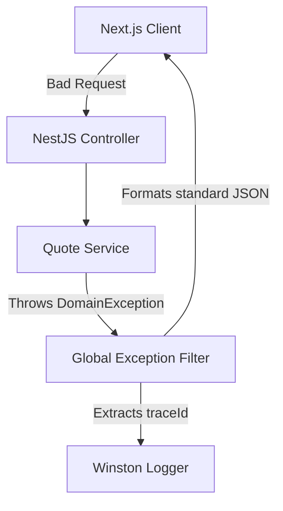

# 34 Global Error Handling

## 1. Purpose

Standardizes how errors are caught, formatted, and presented to both the client and the logging systems, preventing stack traces from leaking to the frontend.

## 2. Scope

Covers NestJS Exception Filters, Next.js Error Boundaries, and standardized JSON error payloads.

## 3. Responsibilities

- **NestJS:** Catch all unhandled exceptions and format them as `RFC 7807` standard Problem Details.
- **Next.js:** Catch React rendering errors using `<ErrorBoundary>` to prevent the entire UI from crashing.

## 4. Dependencies

- `35_LOGGING_AUDIT.md` (for storing the errors)

## 5. The Error Payload Standard

Every error returned by the API must conform exactly to this shape:

```json
{
  "statusCode": 400,
  "timestamp": "2026-06-27T10:00:00.000Z",
  "path": "/api/v1/customer/quotes",
  "message": "Invalid geometry submitted",
  "code": "ERR_INVALID_GEOMETRY",
  "traceId": "uuid-1234-5678",
  "details": [{ "field": "volume", "error": "Must be greater than 0" }]
}
```

## 6. Architecture & Data Flow



## 7. Failure Scenarios

- **Database Down:** Prisma throws a `PrismaClientKnownRequestError`. The Exception Filter catches it, logs a `CRITICAL` alert to Datadog/Axiom, and returns a generic `500 Internal Server Error` to the user with the `traceId`.

## 8. Future Scalability

- The `traceId` is injected into every request via middleware. If we transition to microservices, this `traceId` will be passed in headers to correlate logs across distributed systems (OpenTelemetry).

## 9. Risks

- Leaking SQL syntax errors or internal IP addresses to the frontend in a 500 response. _Mitigation:_ The Global Exception Filter explicitly strips the `stack` property in production environments.

## 10. Open Questions

- None.

## 11. Cross References

- `16_OPERATIONS_MONITORING.md`
