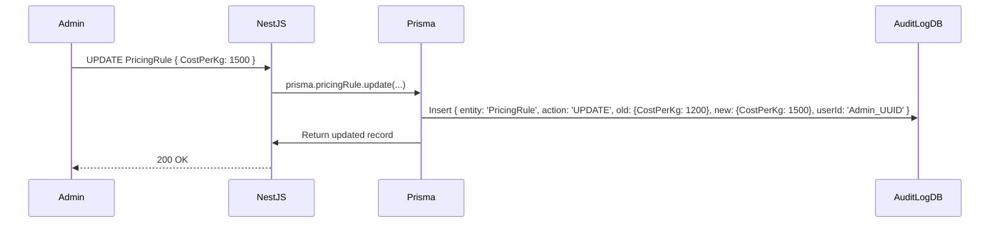

# 35 Logging & Audit Trail Architecture

## 1. Purpose

Ensures absolute accountability for every state mutation within the platform, enabling forensic analysis of financial and manufacturing data.

## 2. Scope

Covers structured application logging (Winston) and database-level entity auditing (AuditLog table).

## 3. Responsibilities

- **NestJS Interceptors:** Automatically log incoming requests and response times.
- **Prisma Middleware:** Automatically intercept `UPDATE` and `DELETE` queries to write to an `AuditLog` table.

## 4. Dependencies

- `34_ERROR_HANDLING.md`
- `04_DATABASE.md`

## 5. Audit Data Flow

## 6. AuditLog Schema Definition

- `id`: UUID
- `entityName`: String (e.g., 'Order', 'PricingRule')
- `entityId`: String
- `action`: Enum (`CREATE`, `UPDATE`, `SOFT_DELETE`)
- `oldData`: JSONB
- `newData`: JSONB
- `userId`: UUID (The actor who made the change)
- `timestamp`: DateTime

## 7. Failure Scenarios

- If the write to the `AuditLog` fails, the primary transaction (e.g., updating the Price) _must_ be rolled back. Auditing is non-negotiable. Both operations must occur within the same PostgreSQL transaction `$transaction`.

## 8. Future Scalability

- The `AuditLog` table will grow massive over time. In V2, we will implement a Cron job to archive logs older than 2 years to a cold-storage R2 bucket in Parquet format for compliance.

## 9. Risks

- Logging PII (Personally Identifiable Information) in plain text. _Mitigation:_ The Prisma middleware must explicitly scrub `passwordHash` and `creditCardToken` fields from the `oldData`/`newData` JSONB payloads before insertion.

## 10. Open Questions

- None.

## 11. Cross References

- `22_BUSINESS_RULES.md`
