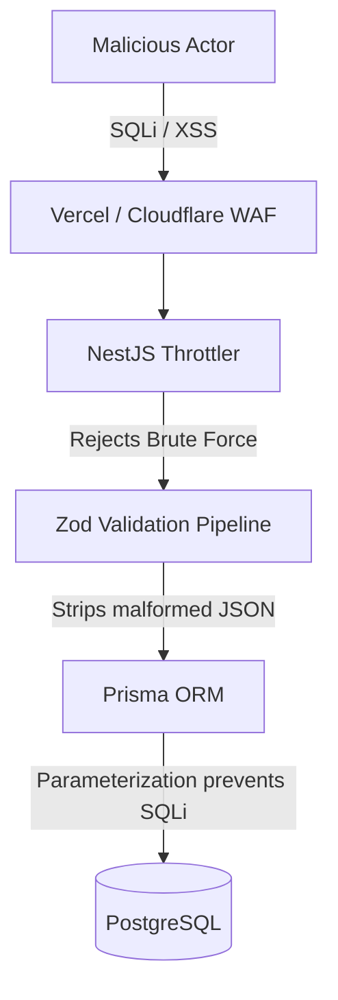

# 36 Security Policies & Vulnerability Management

## 1. Purpose

Defines the proactive security posture for the Only3D platform to protect against OWASP Top 10 vulnerabilities.

## 2. Scope

Covers CORS, Content Security Policy (CSP), Rate Limiting, and Dependency Scanning.

## 3. Responsibilities

- **Infrastructure (Railway/Vercel):** DDoS protection and WAF.
- **NestJS:** Strict input validation and Helmet.js headers.

## 4. Dependencies

- `13_SECURITY_MODEL.md` (JWT & R2)
- `33_API_VERSIONING.md`

## 5. Security Defense Layers

## 6. Core Policies

- **Rate Limiting:** Public endpoints (`/api/auth/login`, `/api/quotes/calculate`) are strictly limited to 10 requests per minute per IP via `@nestjs/throttler`.
- **CORS:** The NestJS API only accepts requests from `https://only3d.com` and `https://admin.only3d.com`. All other origins are blocked.
- **Helmet:** NestJS injects security headers (`Strict-Transport-Security`, `X-Content-Type-Options`, `X-Frame-Options: DENY`).
- **Dependency Scanning:** GitHub Dependabot is enabled to automatically open PRs for vulnerable NPM packages.

## 7. Failure Scenarios

- A user attempts to upload a malicious `.exe` disguised as an `.stl`. _Mitigation:_ Next.js checks the magic bytes before uploading, and the NestJS ParserWorker runs in an isolated container that crashes if it attempts to execute a binary.

## 8. Future Scalability

- Implementation of SOC2 compliance logging and periodic penetration testing by a 3rd party.

## 9. Risks

- **BOLA (Broken Object Level Authorization):** A user modifying the ID in a request `PUT /api/orders/5` to edit someone else's order. _Mitigation:_ The `OrderService` must always append `WHERE userId = req.user.id` to every query if the role is `CUSTOMER`.

## 10. Open Questions

- None.

## 11. Cross References

- `24_AUTH_AUTHORIZATION.md`
