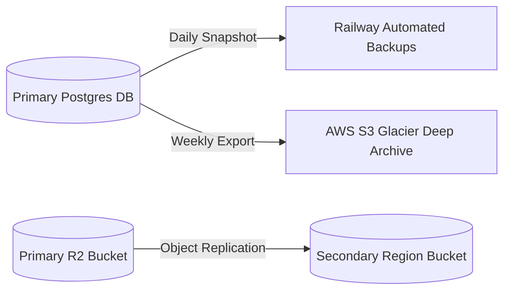

# 37 Backup & Disaster Recovery (DR)

## 1. Purpose

Ensures business continuity in the event of catastrophic infrastructure failure, accidental data deletion, or ransomware.

## 2. Scope

Covers PostgreSQL backups, R2 bucket replication, and Recovery Time Objectives (RTO).

## 3. Responsibilities

- **Railway:** Handles automated Postgres snapshots.
- **Cloudflare:** Handles R2 redundancy.

## 4. Dependencies

- `04_DATABASE.md`
- `15_DEPLOYMENT_PIPELINE.md`

## 5. DR Architecture

## 6. Objectives & Policies

- **Recovery Point Objective (RPO):** 24 hours. In the absolute worst-case scenario (database destroyed), we will lose no more than 1 day of order history.
- **Recovery Time Objective (RTO):** 4 hours. The time it takes to spin up a new database, restore from backup, and re-point the Next.js/NestJS environment variables.
- **Soft Deletes:** As defined in ADR 004 (`12_DECISIONS.md`), we never hard-delete core data, which serves as a first line of defense against accidental Admin errors without needing to trigger a full database restore.

## 7. Failure Scenarios

- **Cloudflare Region Outage:** If R2 US-East goes down, we manually update the `R2_BUCKET_NAME` environment variable to point to the European replicated bucket.

## 8. Future Scalability

- Migrating to an Active-Active multi-region database setup (e.g., CockroachDB or AWS Aurora Global) to reduce RPO to near-zero.

## 9. Risks

- Backups are useless if they cannot be restored. _Mitigation:_ The engineering team must perform a "Fire Drill" every 6 months to test restoring the production backup into a staging environment.

## 10. Open Questions

- None.

## 11. Cross References

- `12_DECISIONS.md` (ADR 004)
