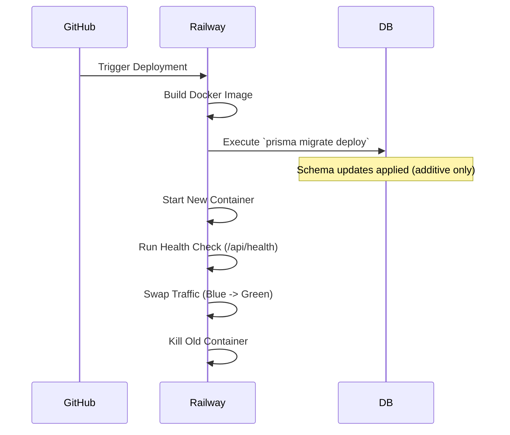

# 38 Deployment Pipeline V2 (Enterprise)

## 1. Purpose

Expands upon the initial deployment strategy to support zero-downtime deployments, database migration safety, and environment parity.

## 2. Scope

Covers Preview environments, Blue/Green deployment concepts, and Prisma migration execution.

## 3. Responsibilities

- **GitHub Actions:** Orchestrates the deployment.
- **Vercel:** Hosts Web/Admin.
- **Railway:** Hosts API/DB.

## 4. Dependencies

- `15_DEPLOYMENT_PIPELINE.md` (Base pipeline)
- `40_TESTING_STANDARDS.md`

## 5. Zero-Downtime Migration Flow

## 6. Migration Safety Rules

- **Forward-Only Migrations:** Never alter an existing column (e.g., dropping a column or renaming it) if it holds production data.
- **Expand & Contract Pattern:**
  - _Phase 1:_ Add new column `new_price`, deploy code that writes to both `old_price` and `new_price`.
  - _Phase 2:_ Run a background script to backfill `new_price` for old rows.
  - _Phase 3:_ Deploy code that only reads/writes `new_price`.
  - _Phase 4:_ Drop `old_price`.

## 7. Failure Scenarios

- If the new NestJS container fails the `/api/health` check on startup, Railway automatically aborts the swap, leaving the old container running. Traffic is uninterrupted.

## 8. Future Scalability

- Transitioning from Railway to Kubernetes (EKS/GKE) for absolute control over autoscaling rules (e.g., scale up API pods if the Redis Queue depth > 1000).

## 9. Risks

- **Database Lock:** A complex Prisma migration (e.g., adding an index to a 10-million row table) can lock the database for minutes, causing 504 Gateway Timeouts. _Mitigation:_ Create indexes `CONCURRENTLY` via raw SQL migrations instead of letting Prisma do it blocking.

## 10. Open Questions

- None.

## 11. Cross References

- `04_DATABASE.md`
