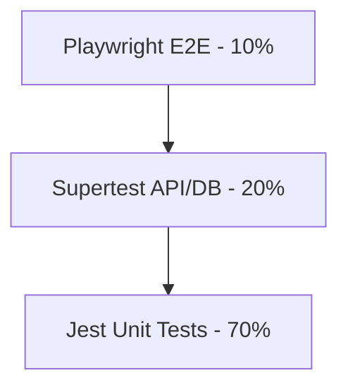

# 40 Testing Standards

## 1. Purpose

Defines the strict rules for what code must be tested, how it must be tested, and the CI gates that enforce these rules.

## 2. Scope

Covers Unit, Integration, and E2E (Playwright) layers across the monorepo.

## 3. Responsibilities

- **Developers:** Write tests alongside feature code.
- **CI Pipeline:** Executes tests and enforces code coverage minimums.

## 4. Dependencies

- `14_TESTING_STRATEGY.md`
- `38_DEPLOYMENT_PIPELINE_V2.md`

## 5. Testing Pyramid & Data Flow

## 6. Strict Rules

- **Coverage Minimum:** Global branch coverage must be `> 85%`. The Quote Engine (`packages/utils/math`) must be strictly `100%`.
- **Database Mocks:** Unit tests _never_ hit a real database. They mock Prisma.
- **Integration Tests:** Must use a real PostgreSQL database spun up via Testcontainers or Docker Compose.
- **Snapshot Tests:** Next.js components rely on Jest snapshots to detect unintended DOM changes.

## 7. Failure Scenarios

- If a Pull Request drops total coverage from 86% to 84%, GitHub Actions automatically blocks the merge button.

## 8. Future Scalability

- Implementing Chaos Engineering (e.g., Gremlin) to randomly kill Redis instances in staging to verify the fallback logic works as intended.

## 9. Risks

- **Flaky E2E Tests:** Playwright tests failing due to network timeouts. _Mitigation:_ E2E tests must aggressively mock external APIs (like Razorpay) and only test internal UI logic.

## 10. Open Questions

- None.

## 11. Cross References

- `08_QUOTE_ENGINE.md`
