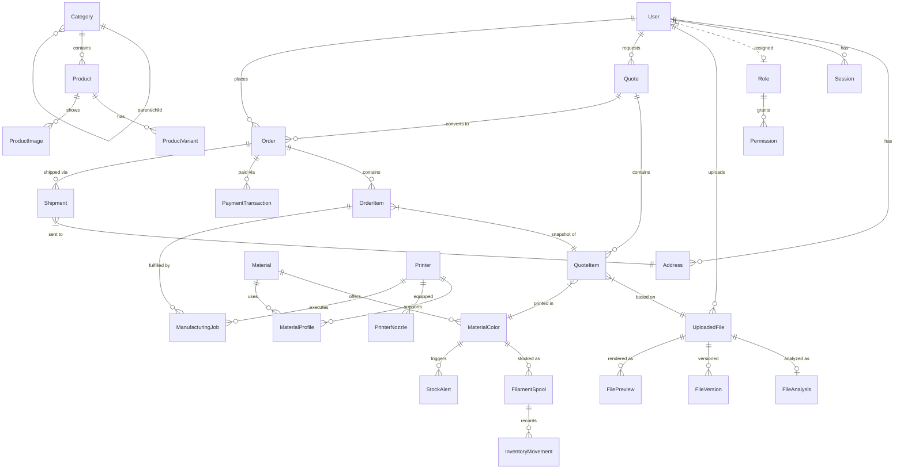

# ER DIAGRAM

```mermaid
erDiagram
    User ||--o{ Address : "has"
    User ||--o{ Session : "has"
    User }|..|o Role : "assigned"
    Role ||--o{ Permission : "grants"

    Category ||--o{ Category : "parent/child"
    Category ||--o{ Product : "contains"
    Product ||--o{ ProductVariant : "has"
    Product ||--o{ ProductImage : "shows"

    Material ||--o{ MaterialColor : "offers"
    Material ||--o{ MaterialProfile : "uses"
    Printer ||--o{ MaterialProfile : "supports"
    Printer ||--o{ PrinterNozzle : "equipped"

    MaterialColor ||--o{ FilamentSpool : "stocked as"
    FilamentSpool ||--o{ InventoryMovement : "records"
    MaterialColor ||--o{ StockAlert : "triggers"

    User ||--o{ UploadedFile : "uploads"
    UploadedFile ||--o| FileAnalysis : "analyzed as"
    UploadedFile ||--o{ FileVersion : "versioned"
    UploadedFile ||--o{ FilePreview : "rendered as"

    User ||--o{ Quote : "requests"
    Quote ||--o{ QuoteItem : "contains"
    QuoteItem }|--|| UploadedFile : "based on"
    QuoteItem }|--|| MaterialColor : "printed in"

    Quote ||--o{ Order : "converts to"
    User ||--o{ Order : "places"
    Order ||--o{ OrderItem : "contains"
    OrderItem }|--|| QuoteItem : "snapshot of"

    OrderItem ||--o{ ManufacturingJob : "fulfilled by"
    Printer ||--o{ ManufacturingJob : "executes"

    Order ||--o{ PaymentTransaction : "paid via"
    Order ||--o{ Shipment : "shipped via"
    Shipment }|--|| Address : "sent to"
```
