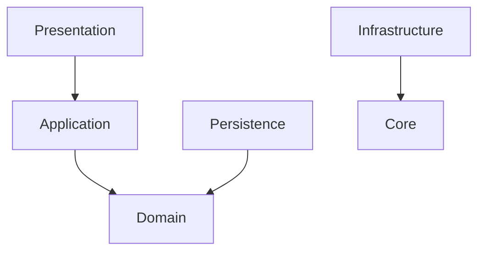

# DEPENDENCY RULES

The Dependency Rule is the heart of Clean Architecture. It states that source code dependencies can only point inward.

## Inner Layers

Inner layers (Domain) contain the business rules. They know nothing about the outside world.

- **Domain** depends on: `Nothing`.
- **Application** depends on: `Domain`.

## Outer Layers

Outer layers contain the delivery mechanisms (HTTP) and the tools (Databases).

- **Presentation** depends on: `Application`, `Domain`.
- **Persistence** depends on: `Domain`, `Prisma`.
- **Infrastructure** depends on: `Core (Interfaces)`.

## Feature Coupling

- A Feature Module (e.g., `Orders`) may NOT import from another Feature Module's `persistence` or `presentation` layer.
- If `Orders` needs to query `Quotes`, it must do so by calling the `QuotesApplicationService` or by listening to a Domain Event.
- **Direct database joins across feature aggregates must be avoided** in the Application layer, and should instead be composed if strictly necessary via explicit read-models.
